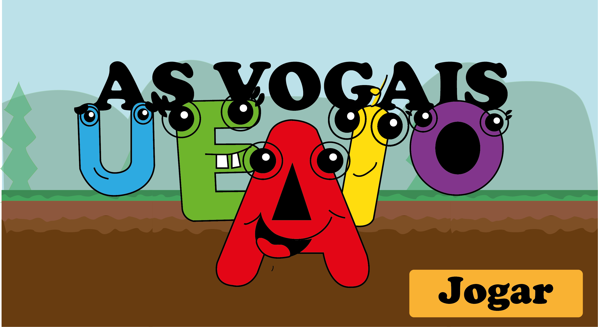
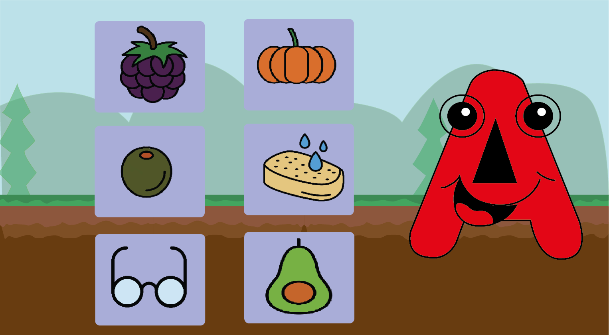

## AS VOGAIS PROJETO FINAL ##

Recursos disponíveis em: https://drive.google.com/drive/folders/16ejVOsOXSY65NCjIc00O8AiDfJMy8z8R?usp=sharing

## SOBRE O JOGO ##
Bem-vindo ao maravilhoso mundo do jogo das vogais! Este jogo educacional é projetado para ajudar as crianças a aprender e aprimorar as suas habilidades na identificação e no reconhecimento das vogais. As vogais são as letras fundamentais do alfabeto, e conhecê-las é essencial para construir uma base sólida na alfabetização e na leitura.

O jogo das vogais é divertido e envolvente, com o objetivo de tornar o processo de aprendizado uma experiência prazerosa. Este utiliza uma variedade de atividades interativas para ensinar às crianças sobre as vogais de uma forma interativa. 

## PÚBLICO ALVO ##
Crianças (ensino pré-escolar e primário)

